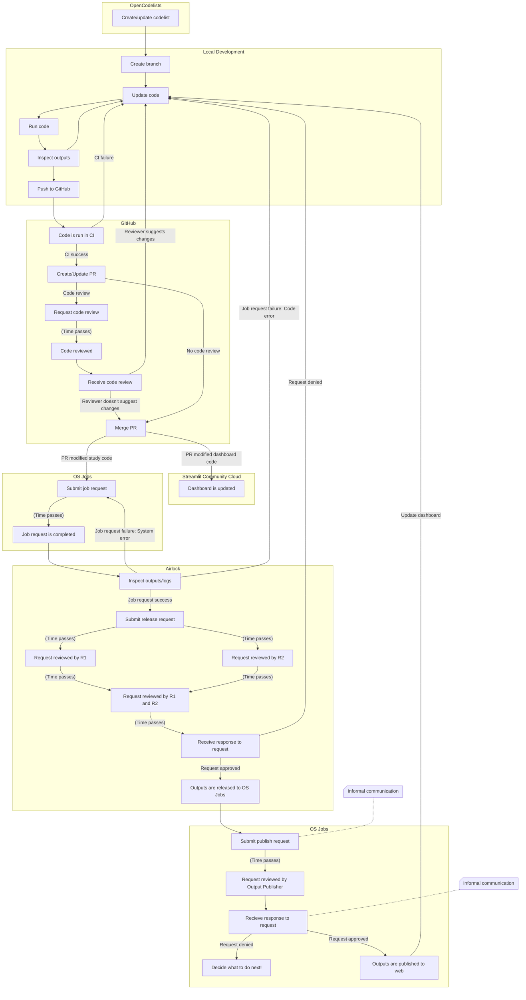

# Walking Skeleton

To demonstrate that the skeleton can walk,
each of the following steps must be prefixed with "There is [a | an | some]...":

* **Motivating problem.**
  We agreed to recreate the Service Restoration Observatory [Liver Function Testing][1] key measure.

* **Codelist** on OpenCodelists.
  The key measure depends on [an existing codelist][2] on OpenCodelists.
  Whilst we may choose to update the existing codelist,
  we don't have to do so to demonstrate that the skeleton can walk.

* **Study code.**
  Ideally, we need a dataset definition and [a measure definition][3].
  If it's not possible to recreate the key measure with a measure definition,
  then we need R, Python, or Stata code
  first to aggregate patient-level data and
  then to apply statistical disclosure control.
  Ultimately, the study code must output a measure table.

* **Approved OpenSAFELY Application.**
  This is created by a member of the OpenPathology team and approved by NHSE.
  There can be no application, project, or workspace (see below)
  without an approved OpenSAFELY application.

* **Application and project** on OS Jobs.
  These are created by a member or the IG team.
  There can be no workspace (see below) without a project
  and no project without an application.

* **Workspace** on OS Jobs.
  This is created by a member of the OpenPathology team.
  Outputs, such as measure tables, are released and published to a workspace.

* **Released measure table** on OS Jobs.
  When the study code is run on the TPP backend, outputs are written to Level 4.
  (Outputs are also written to Level 3, but are inaccessible.)
  The measure table must be reviewed (R1 and R2) and released to OS Jobs.

* **Published measure table** on OS Jobs.
  The released measure table must be reviewed (Output Publisher) and published to OS Jobs.

* **Dashboard code.**
  This represents the published measure table, alongside supporting information.

* **Dashboard app.**
  When deployed to Streamlit Community Cloud, the dashboard code is known as an *app*
  (see "[Dashboards](dashboards.md)").
  Merging the dashboard code to the `main` branch automatically deploys it to Streamlit Community Cloud.

[1]: https://reports.opensafely.org/reports/sro-measures/#ALT
[2]: https://www.opencodelists.org/codelist/opensafely/alanine-aminotransferase-alt-tests/2298df3e/
[3]: https://docs.opensafely.org/ehrql/explanation/measures/

## Workflow

