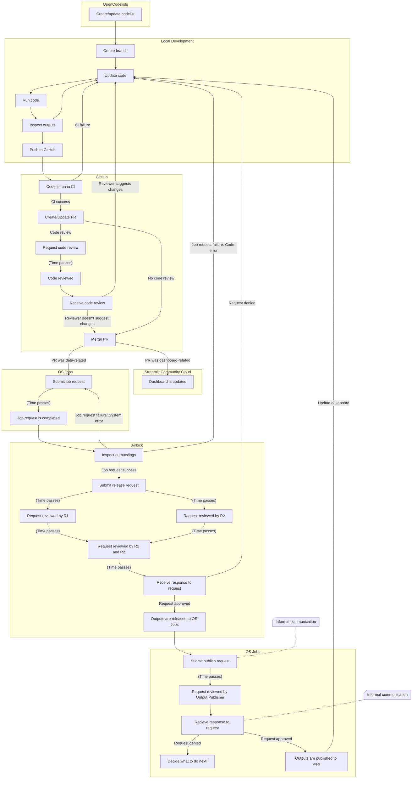

# Walking Skeleton

```mermaid
flowchart TD
    subgraph Local Development
    create_branch[Create branch] --> update_locally[Update code]
    update_locally --> run_locally[Run code]
    run_locally --> inspect_locally[Inspect outputs]
    inspect_locally --> update_locally
    inspect_locally --> push_to_gh[Push to GitHub]
    end
    subgraph OpenCodelists
    create_codelist[Create/update codelist] --> create_branch
    end
    subgraph GitHub
    push_to_gh --> run_ci[Code is run in CI]
    run_ci -->|CI failure| update_locally
    run_ci -->|CI success| create_pr[Create/Update PR]
    create_pr -->|Code review| request_code_review[Request code review]
    request_code_review -->|"(Time passes)"| code_reviewed[Code reviewed]
    code_reviewed --> receive_code_review[Receive code review]
    receive_code_review -->|Reviewer suggests changes| update_locally
    receive_code_review -->|Reviewer doesn't suggest changes| merge_pr[Merge PR]
    create_pr -->|No code review| merge_pr
    end
    subgraph Streamlit Community Cloud
    merge_pr -->|PR was dashboard-related| end_1[Dashboard is updated]
    end
    subgraph OS Jobs
    merge_pr -->|PR was data-related| submit_job_request[Submit job request]
    submit_job_request -->|"(Time passes)"| job_request_completed[Job request is completed]
    end
    subgraph Airlock
    job_request_completed --> inspect_l4[Inspect outputs/logs]
    inspect_l4 -->|Job request failure: System error| submit_job_request
    inspect_l4 -->|Job request failure: Code error| update_locally
    inspect_l4 -->|Job request success| submit_release_request[Submit release request]
    submit_release_request -->|"(Time passes)"| reviewed_r1[Request reviewed by R1]
    submit_release_request -->|"(Time passes)"| reviewed_r2[Request reviewed by R2]
    reviewed_r1 -->|"(Time passes)"| reviewed_r1_r2[Request reviewed by R1 and R2]
    reviewed_r2 -->|"(Time passes)"| reviewed_r1_r2
    reviewed_r1_r2 -->|"(Time passes)"| receive_response[Receive response to request]
    receive_response -->|Request approved| outputs_released[Outputs are released to OS Jobs]
    receive_response -->|Request denied| update_locally
    end
    subgraph OS Jobs
    outputs_released --> submit_publish_request[Submit publish request]
    submit_publish_request -->|"(Time passes)"| reviewed_r3[Request reviewed by Output Publisher]
    reviewed_r3 --> receive_publication_response[Recieve response to request]
    receive_publication_response -->|Request denied| end_2[Decide what to do next!]
    receive_publication_response -->|Request approved| outputs_published[Outputs are published to web]
    end
    outputs_published -->|Update dashboard| update_locally
    note_1@{shape: notch-rect, label: "Informal communication"}
    note_1 -.- submit_publish_request
    note_2@{shape: notch-rect, label: "Informal communication"}
    note_2 -.- receive_publication_response
```
